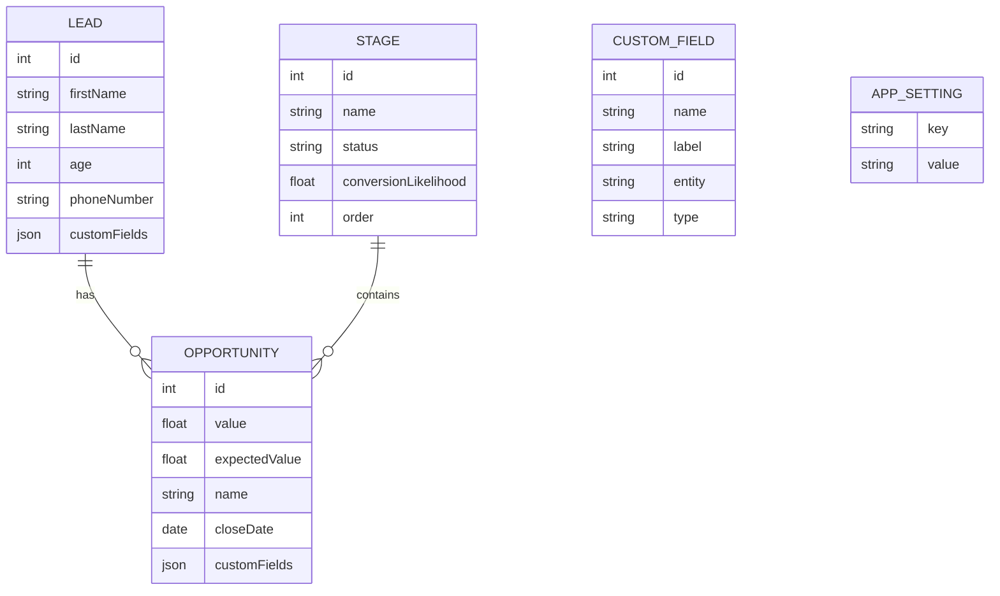

# Data Model

The data model lives in `code/server/src/entity/`. Each file defines one **entity** — a
TypeScript class decorated so TypeORM maps it to a database table. There are five
entities.

| Entity | Represents | Table source |
| --- | --- | --- |
| `Lead` | A potential customer tracked by sales reps | `entity/Lead.ts` |
| `Opportunity` | A deal being worked for a lead | `entity/Opportunity.ts` |
| `Stage` | A step in the sales pipeline | `entity/Stage.ts` |
| `CustomField` | A user-defined field definition | `entity/CustomField.ts` |
| `AppSetting` | A global key/value configuration row | `entity/AppSetting.ts` |

## Lead

A person a sales rep is pursuing.

| Field | Type | Notes |
| --- | --- | --- |
| `id` | number | Auto-generated primary key |
| `firstName` | string | |
| `lastName` | string | |
| `age` | number | |
| `phoneNumber` | string | |
| `customFields` | JSON object | Key/value bag of extra data (see [Custom fields](#custom-fields)) |
| `opportunities` | `Opportunity[]` | One-to-many: a lead can have zero or many opportunities |

## Opportunity

A single deal being worked for a lead.

| Field | Type | Notes |
| --- | --- | --- |
| `id` | number | Auto-generated primary key |
| `lead` | `Lead` | Many-to-one: each opportunity belongs to exactly one lead |
| `stage` | `Stage` | Many-to-one: each opportunity is in exactly one stage at a time |
| `value` | number (real) | The raw dollar value of the deal |
| `expectedValue` | number (real) | `value` weighted by the stage's likelihood (see [Business logic](./business-logic.md)) |
| `name` | string | A label for the deal (e.g. "Enterprise Deal") |
| `closeDate` | date string &#124; null | Expected close date (`YYYY-MM-DD`), optional |
| `customFields` | JSON object | Key/value bag of extra data |

## Stage

A step in the sales pipeline. Every opportunity references one stage.

| Field | Type | Notes |
| --- | --- | --- |
| `id` | number | Auto-generated primary key |
| `name` | string | e.g. "Cold Lead", "Negotiation", "Deal Signed" |
| `status` | `"pending"` &#124; `"won"` &#124; `"lost"` | Drives which likelihood is used |
| `conversionLikelihood` | number (real) | Probability (0–1) used for `pending` stages |
| `order` | number | Sort position within the pipeline |
| `opportunities` | `Opportunity[]` | One-to-many: all opportunities currently in this stage |

## CustomField

A definition that describes _which_ custom fields exist and what they apply to. It does
**not** store the values themselves — those live in the `customFields` bag on each Lead or
Opportunity.

| Field | Type | Notes |
| --- | --- | --- |
| `id` | number | Auto-generated primary key |
| `name` | string | Unique machine name (the key used in the `customFields` bag) |
| `label` | string | Human-readable display label |
| `entity` | string | Which entity it applies to: `"lead"` or `"opportunity"` (default `"lead"`) |
| `type` | string | Field type, e.g. `"text"` or `"number"` (default `"text"`) |

## AppSetting

A simple global configuration row. See [Business logic](./business-logic.md) for the
specific keys used.

| Field | Type | Notes |
| --- | --- | --- |
| `key` | string | Primary key (the setting name) |
| `value` | string | The stored value (parsed to a number where needed) |

## Relationships at a glance

```
Lead 1 ───< many Opportunity many >─── 1 Stage
```

The same relationships and standalone metadata/config tables are shown below as a Mermaid ER diagram:



`CustomField` and `AppSetting` are standalone metadata/config tables (not foreign-keyed), while `Opportunity → Lead` and `Opportunity → Stage` are eager relations.

- A **Lead** has many **Opportunities**; each Opportunity belongs to one Lead.
- A **Stage** has many **Opportunities**; each Opportunity is in one Stage.

### Eager loading

The `Opportunity → Lead` and `Opportunity → Stage` relationships are marked **eager**.
That means whenever an opportunity is loaded from the database, TypeORM automatically
pulls in its lead and stage too — handlers don't have to request them explicitly. So
loading opportunities returns fully populated objects (with nested lead and stage data)
out of the box.

## Custom fields

Both `Lead` and `Opportunity` have a `customFields` column stored as **JSON** (a
`simple-json` column in TypeORM). Think of it as a flexible bag of key/value pairs:

```json
{ "industry": "Healthcare", "region": "EMEA" }
```

The `CustomField` table describes which keys are available and whether each applies to
leads or opportunities (its `entity` discriminator). This design lets users add new fields
without changing the database schema — the actual values just go into the JSON bag on each
record.
