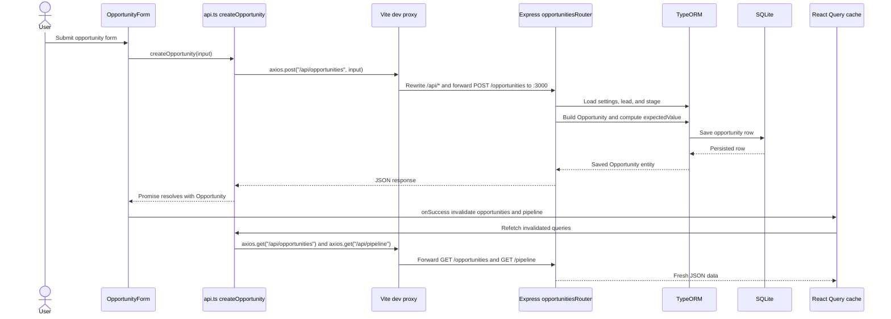

# Frontend Data Layer

The SimpleCRM frontend keeps server data in one small, predictable layer: `src/api.ts`
defines the HTTP calls and cache keys, and TanStack Query owns the read/write cache in
React components. For the server contract, see the [API reference](../backend/api-reference.md).
For expected-value rules used when opportunities are saved, see
[Business logic](../backend/business-logic.md). This page sits beside the
[frontend overview](./README.md).

## API module (`src/api.ts`)

All server calls are centralized in `code/client/src/api.ts` and use **axios**. Every
request URL starts with `/api/...`; in development, the Vite proxy forwards those calls to
`http://localhost:3000` and strips the `/api` prefix before Express sees the request.
That means `axios.post("/api/opportunities")` becomes `POST /opportunities` on the server.

`src/api.ts` also exports the shared query-key object used by every `useQuery` and
`invalidateQueries` call:

| Key | Value | Used for |
| --- | --- | --- |
| `queryKeys.leads` | `["leads"]` | Lead list reads and lead mutations |
| `queryKeys.opportunities` | `["opportunities"]` | Opportunity list reads and opportunity mutations |
| `queryKeys.customFields` | `["customFields"]` | Custom-field definition reads and mutations |
| `queryKeys.stages` | `["stages"]` | Stage reads and mutations |
| `queryKeys.settings` | `["settings"]` | App-setting reads and mutations |
| `queryKeys.pipeline` | `["pipeline"]` | Pipeline report reads and mutations that affect rollups |

Input types for writes live in the same file: `LeadInput`, `OpportunityInput`,
`CustomFieldInput`, and `StageInput`. They are hand-written client-side request shapes,
not generated from the server entities.

| Resource | Fetch | Create | Update | Delete |
| --- | --- | --- | --- | --- |
| Leads | `fetchLeads()` -> `GET /api/leads` | `createLead(input)` -> `POST /api/leads` | `updateLead(id, input)` -> `PUT /api/leads/:id` | `deleteLead(id)` -> `DELETE /api/leads/:id` |
| Opportunities | `fetchOpportunities()` -> `GET /api/opportunities` | `createOpportunity(input)` -> `POST /api/opportunities` | `updateOpportunity(id, input)` -> `PUT /api/opportunities/:id` | `deleteOpportunity(id)` -> `DELETE /api/opportunities/:id` |
| Custom fields | `fetchCustomFields()` -> `GET /api/custom-fields` | `createCustomField(input)` -> `POST /api/custom-fields` | - | `deleteCustomField(id)` -> `DELETE /api/custom-fields/:id` |
| Stages | `fetchStages()` -> `GET /api/stages` | `createStage(input)` -> `POST /api/stages` | `updateStage(id, input)` -> `PUT /api/stages/:id` | `deleteStage(id)` -> `DELETE /api/stages/:id` |
| Settings | `fetchSettings()` -> `GET /api/settings` | - | `updateSetting(key, value)` -> `PUT /api/settings/:key` | - |
| Pipeline | `fetchPipeline()` -> `GET /api/pipeline` | - | - | - |

## TanStack Query setup

`code/client/src/main.tsx` creates one `QueryClient` and provides it to the app through
`QueryClientProvider`. Its default query options are intentionally simple:

- `staleTime: 30_000` — fetched data is treated as fresh for 30 seconds.
- `refetchOnWindowFocus: false` — switching back to the browser tab does not
  automatically refetch.

The read pattern is consistent across the app: components call `useQuery` with one of the
`queryKeys.*` values and the matching `fetch*` function from `src/api.ts`. For example,
`leads.tsx` reads `queryKeys.leads` with `fetchLeads`, and `pipeline.tsx` reads
`queryKeys.pipeline` with `fetchPipeline`.

The write pattern is also consistent: forms and management screens call `useMutation`,
invoke a `create*`, `update*`, or `delete*` function, then use
`queryClient.invalidateQueries` in `onSuccess` so affected reads refetch. There are no
optimistic updates; the UI waits for the server response and then refreshes the relevant
cache entries.

## Invalidation matrix

These are the invalidations currently wired in client components.

| Mutation | Component(s) | Invalidated query keys |
| --- | --- | --- |
| Lead create | `lead-form.tsx` | `queryKeys.leads` |
| Lead update | `lead-form.tsx` | `queryKeys.leads` |
| Lead delete | Not currently wired in a client mutation | None in current UI |
| Opportunity create | `opportunity-form.tsx` | `queryKeys.opportunities`, `queryKeys.pipeline` |
| Opportunity update | `opportunity-form.tsx` | `queryKeys.opportunities`, `queryKeys.pipeline` |
| Opportunity delete | `lead-opportunities.tsx`, `forecast.tsx` | `queryKeys.opportunities`, `queryKeys.pipeline` |
| Custom-field create | `manage-fields.tsx` | `queryKeys.customFields` |
| Custom-field delete | `manage-fields.tsx` | `queryKeys.customFields` |
| Stage create | `manage-stages.tsx` | `queryKeys.stages`, `queryKeys.pipeline` |
| Stage update | `manage-stages.tsx` | `queryKeys.stages`, `queryKeys.pipeline` |
| Stage delete | `manage-stages.tsx` | `queryKeys.stages`, `queryKeys.pipeline` |
| Setting update | `manage-settings.tsx` | `queryKeys.settings`, `queryKeys.opportunities`, `queryKeys.stages`, `queryKeys.pipeline` |

The setting update invalidates more than the settings list so any views that read
opportunities, stages, or the pipeline refetch after a change. Note, though, that the
server recomputes an opportunity's `expectedValue` **only when that opportunity is created
or updated** (`POST`/`PUT /opportunities`) — changing `wonStageLikelihood` or
`lostStageLikelihood` does not retroactively rewrite stored expected values, and
`GET /pipeline` sums the values already stored. So the refetch mainly keeps these views in
sync rather than reflecting a server-side mass recalculation.

## Create-opportunity round trip

